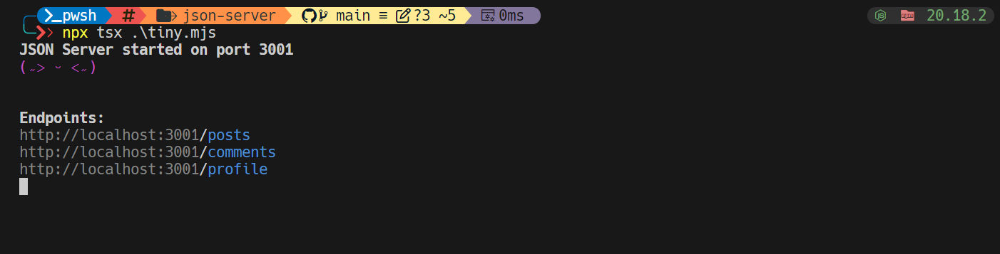
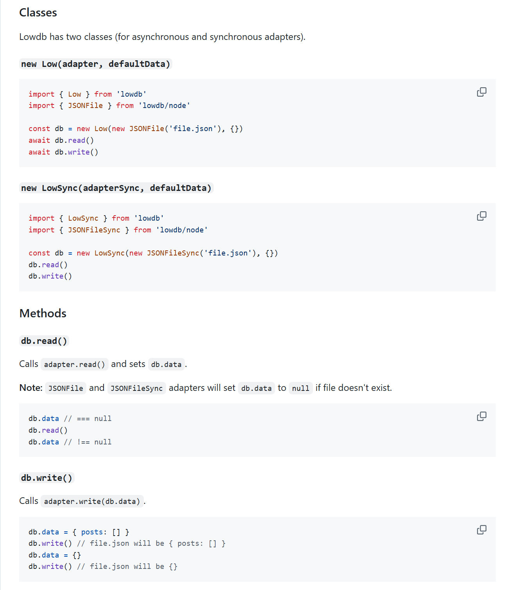
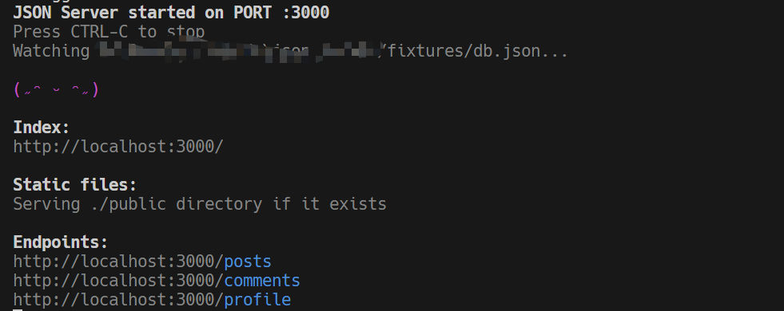
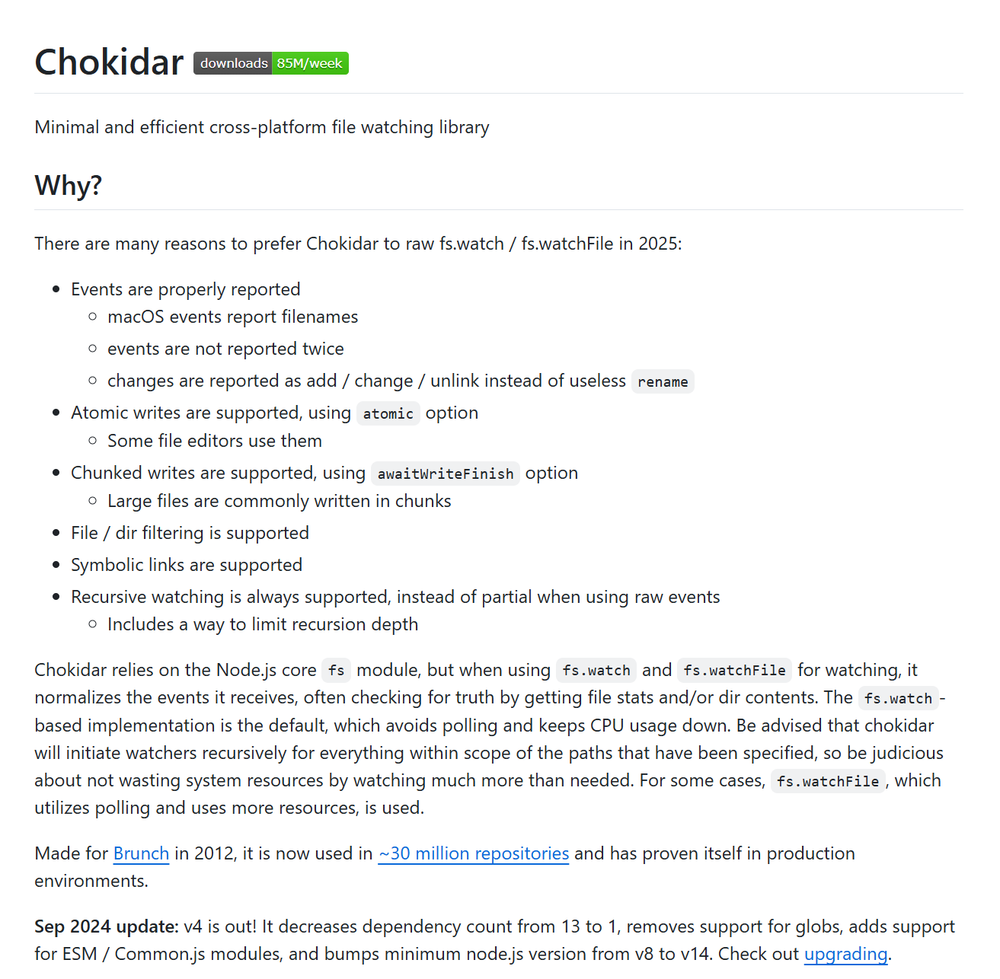

在前端开发中，构建一套完整的后端接口往往耗时费力，而 [json-server](https://github.com/typicode/json-server)正是为了解决这一痛点而生。只需一个 JSON 文件，它就能快速生成一个 REST API 服务，被广泛用于前端开发、原型验证、接口测试等场景。本文将深入剖析 [json-server](https://github.com/typicode/json-server)的源码，一起理解它是如何工作的，并从中学习一些开发技巧。

<!--more-->


剖析的`json-server`版本为`v1.0.0-beta.3`。


## 一个简单但不完整的实现

由于有一些 Express 的使用经验，在阅读了[json-server](https://github.com/typicode/json-server)的 README.md 介绍后，我的初始想法是将`db.json`文件加载然后遍历对象，将`key`作为路由的 Endpoint 即可，由于有了以下代码：

```typescript {data-open=true}
import dbJson from './fixtures/db.json';
import express from 'express';
import { json } from 'milliparsec';
import crypto from 'crypto';
import chalk from 'chalk';
import { Eta } from 'eta';
import { fileURLToPath } from 'url';
import { dirname, join } from 'path';

const PORT = 3001;
const app = new express();
const __filename = fileURLToPath(import.meta.url);
const __dirname = dirname(__filename);
const eta = new Eta({
  views: join(__dirname, 'views'),

  cache: true,
});
app.use(json());

const kaomojis = ['(˶ᵔ ᵕ ᵔ˶)', '(˶ˆᗜˆ˵)', '(˶˃ ᵕ ˂˶)', '( ∩´͈ ᐜ `͈∩)'];

function randomEmoji() {
  return kaomojis[Math.floor(Math.random() * kaomojis.length)];
}

const routes = [];
const baseUrl = `http://localhost:${PORT}`;
console.log(chalk.bold(`JSON Server started on port ${PORT}`));
console.log(chalk.magenta(randomEmoji()));

for (const key in dbJson) {
  routes.push(`${key}`);

  app.get(`/${key}`, (_, res) => {
    res.json(dbJson[key]);
  });

  app.get(`/${key}/:id`, (req, res) => {
    const { id } = req.params;
    let findById = [];
    if (Array.isArray(dbJson[key])) {
      findById = res.json(dbJson[key].find((item) => item.id === id));
    }
    res.json(findById);
  });

  app.post(`/${key}`, (req, res) => {
    const { body } = req;
    if (!body.id) {
      body.id = crypto.randomUUID();
    }
    if (Array.isArray(dbJson[key])) {
      dbJson[key].push(body);
    } else {
      dbJson[key] = body;
    }
    res.json(body);
  });

  app.put(`/${key}/:id`, (req, res) => {
    const { id } = req.params;
    const { body } = req;
    const index = dbJson[key].findIndex((item) => item.id === id);
    if (index !== -1) {
      dbJson[key][index] = body;
      res.json(body);
    } else {
      res.status(404).json({ error: 'Not found' });
    }
  });

  app.delete(`/${key}/:id`, (req, res) => {
    const { id } = req.params;
    const index = dbJson[key].findIndex((item) => item.id === id);
    if (index !== -1) {
      dbJson[key].splice(index, 1);
      res.json({ message: 'Deleted' });
    } else {
      res.status(404).json({ error: 'Not found' });
    }
  });
}

app.get('/', (_, res) => {
  const renderedData = {
    data: dbJson,
  };
  const renderedTemplate = eta.render('index.html', renderedData);
  res.send(renderedTemplate);
});

console.log('\n');
console.log(chalk.bold('Endpoints:'));
console.log(
  routes
    .map((route) => `${chalk.gray(baseUrl)}/${chalk.blue(route)}`)
    .join('\n')
);
app.listen(PORT);
```

`npx tsx ./tiny.mjs`启动程序终端输出如下：



访问上述 Endpoint 能够正常获取到数据，并支持`POST`、`DELETE`、`PUT`等操作，初步看起来颇有点[json-server](https://github.com/typicode/json-server)的味道。然而，实际使用中仍然存在以下几个问题：

### 问题 1：启动方式不便

当前的启动方式是通过 `npx tsx ./tiny.mjs`，显然这并不方便作为一个 CLI 工具来使用。理想状态下，我们希望它能像 `vite` 那样，安装后通过一个命令（如 `tiny-server`）即可启动服务。

### 问题 2：数据无法持久化

虽然可以对资源执行 `POST`、`PUT`、`DELETE` 操作，但这些变更不会被持久化保存。应用一旦重启，所有数据都会恢复为初始状态。

### 问题 3：热更新缺失

修改 `db.json` 文件后，当前服务不会感知到变更，也无法实时更新数据内容。这意味着我们需要手动重启服务，才能看到修改结果。

幸运的是，[json-server](https://github.com/typicode/json-server)在这几个方面都有成熟的实现。那么它是如何做到的？下面我们就带着这三个问题，一步步剖析[json-server](https://github.com/typicode/json-server)的源码，看看它是如何实现这些特性的。

## 命令行工具化：如何实现像`vite`一样的 CLI 启动？

当前是通过`npx tsx ./tiny.mjs`启动服务，这种方式不适合作为常规 CLI 工具发布与使用。我们希望能通过`tiny-server`这样一个命令来直接运行项目，像`vite`一样方便。

[json-server](https://github.com/typicode/json-server)是如何做到的？查看`package.json`文件，可以看到这段配置：

```json
  "bin": {
    "json-server": "lib/bin.js"
  }
```

这段配置的意思是：当用户安装[json-server](https://github.com/typicode/json-server)时（例如`npm install -g json-server`）,npm 会自动在系统的`PATH`中注册一个名为`json-server`的可执行命令，并将其映射到项目目录下的`lib/bin.js`脚本。

然而，Clone 下来的源码中并没有`lib/bin.js`文件。查看`package.json`文件，可以看到这段配置：

```json
  "scripts": {
    "build": "rm -rf lib && tsc",
  }
```

当运行`npm run build`时，npm 会执行对应的脚本命令：

```bash
rm -rf lib && tsc
```

`rm -rf lib`会删除`lib`目录及其所有内容（如果存在）。`&&`是一个 Bash 连接符，表示其哪一个命令成功后再执行后一个。`tsc`会根据`tsconfig.json`把`src`目录中的`.ts`文件编译成`.js`文件，输出到`lib`目录（或者在`tsconfig`中设置的目录）。

执行`npm run build`生成`lib`目录中包含了`bin.js`文件。

`bin.js`顶部有以下[Shebang](<https://www.wikiwand.com/en/articles/Shebang_(Unix)>)：

```bash
#!/usr/bin/env node
```

这段代码让脚本可以在终端中直接作为命令运行，而不需要再手动用`node`或`npx`启动。`bin.js`由`src/bin.ts`编译生成（观察得到 😁）。根据前面的说明，当我们安装好`json-server`，执行`npx json-server db.json`命令时，其实就是在运行`src/bin.ts`文件。为了方便调试`src/bin.ts`文件，参考[VS Code debugging](https://tsx.is/vscode)进行配置，在项目根目录下`.vscode`下创建`launch.json`文件，粘贴如下内容：

```json
{
  // Use IntelliSense to learn about possible attributes.

  // Hover to view descriptions of existing attributes.

  // For more information, visit: https://go.microsoft.com/fwlink/?linkid=830387

  "version": "0.2.0",

  "configurations": [
    {
      "type": "node",

      "request": "launch",

      "name": "tsx",

      "program": "${workspaceFolder}/src/bin.ts",

      "runtimeExecutable": "tsx",

      "console": "integratedTerminal",

      "internalConsoleOptions": "neverOpen",

      "args": ["${workspaceFolder}/fixtures/db.json"], // Files to exclude from debugger (e.g. call stack)

      "skipFiles": [
        // Node.js internal core modules

        "<node_internals>/**", // Ignore all dependencies (optional)

        "${workspaceFolder}/node_modules/**"
      ]
    }
  ]
}
```

正常配置好就可以在`src`目录下的`.ts`文件中打断点进行调试啦。

`src/bin.ts`首先定义了`help`和`args`两个函数，根据函数名和注释来看，`help`用于打印帮助信息，`args`用于解析命令行参数并返回一个包含`file`（文件名，类型为`string`）、`port`（端口号，类型为`number`）、`host`（主机，类型为`string`）和`static`（静态文件/目录，类型为`string[]`）。

`args`函数定义如下：

```typescript {data-open=true}
// Parse args

function args(): {
  file: string;
  port: number;
  host: string;
  static: string[];
} {
  try {
    const { values, positionals } = parseArgs({
      options: {
        port: {
          type: 'string',
          short: 'p',
          default: process.env['PORT'] ?? '3000',
        },
        host: {
          type: 'string',
          short: 'h',
          default: process.env['HOST'] ?? 'localhost',
        },
        static: {
          type: 'string',
          short: 's',
          multiple: true,
          default: [],
        },
        help: {
          type: 'boolean',
        },
        version: {
          type: 'boolean',
        }, // Deprecated
        watch: {
          type: 'boolean',
          short: 'w',
        },
      },
      allowPositionals: true,
    }); // --version
    if (values.version) {
      const pkg = JSON.parse(
        readFileSync(
          fileURLToPath(new URL('../package.json', import.meta.url)),
          'utf-8'
        )
      ) as PackageJson;
      console.log(pkg.version);
      process.exit();
    } // Handle --watch

    if (values.watch) {
      console.log(
        chalk.yellow(
          '--watch/-w can be omitted, JSON Server 1+ watches for file changes by default'
        )
      );
    }

    if (values.help || positionals.length === 0) {
      help();
      process.exit();
    } // App args and options

    return {
      file: positionals[0] ?? '',
      port: parseInt(values.port as string),
      host: values.host as string,
      static: values.static as string[],
    };
  } catch (e) {
    if ((e as NodeJS.ErrnoException).code === 'ERR_PARSE_ARGS_UNKNOWN_OPTION') {
      console.log(
        chalk.red((e as NodeJS.ErrnoException).message.split('.')[0])
      );
      help();
      process.exit(1);
    } else {
      throw e;
    }
  }
}
```

`args`函数主要用了来自`node:util`内置模块的[`parseArgs`函数](https://nodejs.org/api/util.html#utilparseargsconfig),让`npx tsx ./src/bin.ts`支持`--port`、`--host`，`--static`、`--help`、`--version`和`--watch`等选项，且允许位置参数(` allowPositionals: true`)，但位置参数最后只会返回一个：

```typescript {data-open=true}
return {
  file: positionals[0] ?? '',
  port: parseInt(values.port as string),
  host: values.host as string,
  static: values.static as string[],
};
```

当我们运行`npx tsx src/bin.ts`时，马上会执行这行代码：

```typescript {data-open=true}
const { file, port, host, static: staticArr } = args();
```

接着会检测`file`是否存在，如果不存在的话直接退出。然后，判断`file`的内容是否为空，如果为空则在`file`中写入`{}`。之后`src/bin.ts`还做了 3 件事，分别是设置数据库、创建 REST API 应用以及监听文件的改变。

## 数据持久化：让 POST、PUT、DELETE 操作不再丢失

为了将数据持久化，[json-server](https://github.com/typicode/json-server)用了[lowdb](https://github.com/typicode/lowdb)数据库，可以让我们从繁琐的读写`db.json`中解脱出来。`src/bin.ts`文件中的如下代码用于设置数据库,：

```typescript {data-open=true}
// Set up database

let adapter: Adapter<Data>;

if (extname(file) === '.json5') {
  adapter = new DataFile<Data>(file, {
    parse: JSON5.parse,

    stringify: JSON5.stringify,
  });
} else {
  adapter = new JSONFile<Data>(file);
}

const observer = new Observer(adapter);

const db = new Low<Data>(observer, {});

await db.read();

// ...

let writing = false; // true if the file is being written to by the app

let prevEndpoints = '';

observer.onWriteStart = () => {
  writing = true;
};

observer.onWriteEnd = () => {
  writing = false;
};

observer.onReadStart = () => {
  prevEndpoints = JSON.stringify(Object.keys(db.data).sort());
};

observer.onReadEnd = (data) => {
  if (data === null) {
    return;
  }

  const nextEndpoints = JSON.stringify(Object.keys(data).sort());

  if (prevEndpoints !== nextEndpoints) {
    console.log();

    logRoutes(data);
  }
};
```

短短的十几行代码已经用到了至少 3 中设计模式：==策略模式（Strategy Pattern）==[primary]、==适配器模式（Adapter Pattern）==[primary]和==观察者模式（Observer Pattern）==[primary]。

==策略模式==[primary]目的是在运行时选择行为。这里通过文件扩展名（`.json5`或`.json`）决定使用不同的`adapter`，在运行时动态选择具体的解析策略。

==适配器模式==[primary]目的是将一个接口转换为所期望的另一个接口。`DataFile<Data>`和`JSONFile<Data>`都实现`Adapter<Data>`接口。它们将底层文件读写（如 JSON、JSON5）都转换成统一的接口，供`Low`类使用。

==观察者模式==[primary]目的是当被观察者状态变化时，通知所有注册的观察者。`Observer`对象通过注册回调函数监听数据的读取与写入事件。当数据库操作发生时，回调自动执行，实现“事件驱动”响应。[lowdb](https://github.com/typicode/lowdb)的 README.md 文件，有这样的描述：当调用`db.read()`时，会调用`adapter.read()`；当调用`db.write()`时，会调用`adapter.write()`。



`Adapter`接口原本只有`read`和`write`两个方法：

```typescript {data-open=true}
export interface Adapter<T> {
  read: () => Promise<T | null>;

  write: (data: T) => Promise<void>;
}
```

为了不让`Observer`破环这种调用关系：

> 当调用`db.read()`时，会调用`adapter.read()`；当调用`db.write()`时，会调用`adapter.write()`。

`Observer`必定也需要有`read`和`write`方法。`src/observer.ts`的`Observer`类定义如下：

```typescript {data-open=true}
import { Adapter } from 'lowdb';

// Lowdb adapter to observe read/write events

export class Observer<T> {
  #adapter;

  onReadStart = function () {
    return;
  };

  onReadEnd: (data: T | null) => void = function () {
    return;
  };

  onWriteStart = function () {
    return;
  };

  onWriteEnd = function () {
    return;
  };

  constructor(adapter: Adapter<T>) {
    this.#adapter = adapter;
  }

  async read() {
    this.onReadStart();

    const data = await this.#adapter.read();

    this.onReadEnd(data);

    return data;
  }

  async write(arg: T) {
    this.onWriteStart();

    await this.#adapter.write(arg);

    this.onWriteEnd();
  }
}
```

`Observer`类接受一个`Adapter`类实例作为参数，然后通过包装`read`和`write`方法，在它们的执行前后插入了自定义的钩子函数（`onReadStart`、`onReadEnd`等），**相当于给原本的`Adapter`添加了“读写观察”功能**，允许我们在读前、读后、写前和写后做一些想要的操作。体现了装饰器模式（Decorator Pattern）。装饰器模式允许在不改变原始对象结构的前提下，动态地给一个对象添加一些额外的功能。`observer.onWriteStart`和`observer.onWriteEnd`让变量`writing`记录了当前数据库是否处于写状态。`observer.onReadStart`和`observer.onReadEnd`通过比较 EndPoints 是否改变决定要不要重新在终端打印输出路由信息。



到目前为止都没有涉及到`db.write`操作，那么会在哪儿呢？仔细分析一下就知道要在`POST`、`PUT`、`DELETE`等请求时进行`db.write`操作。而对应的路由定义在`src/app.ts`中：

```typescript {data-open=true}
app.post('/:name', async (req, res, next) => {
  const { name = '' } = req.params;

  if (isItem(req.body)) {
    res.locals['data'] = await service.create(name, req.body);
  }

  next?.();
});

app.put('/:name', async (req, res, next) => {
  const { name = '' } = req.params;

  if (isItem(req.body)) {
    res.locals['data'] = await service.update(name, req.body);
  }

  next?.();
});

app.put('/:name/:id', async (req, res, next) => {
  const { name = '', id = '' } = req.params;

  if (isItem(req.body)) {
    res.locals['data'] = await service.updateById(name, id, req.body);
  }

  next?.();
});
```

回调函数中都使用了`service`变量，而它是一个`Service`对象。我们随意查看一个上述代码使用到的`Serivce`方法，比如`create`方法（定义在`src/service.ts`中）：

```typescript {data-open=true}
  async create(

    name: string,

    data: Omit<Item, 'id'> = {},

  ): Promise<Item | undefined> {

    const items = this.#get(name)

    if (items === undefined || !Array.isArray(items)) return


    const item = { id: randomId(), ...data }

    items.push(item)


    await this.#db.write()

    return item

  }
```

可以看到确实调用了`db.write`方法。这种将路由回调函数逻辑简化，并将核心业务逻辑整合到`Service`类的做法值得学习与借鉴。

## 热更新支持：如何监听`db.json`变化自动加载？

如何支持热更新？答案是通过[chokidar](https://github.com/paulmillr/chokidar)的`watch`函数实现。



`src/bin.ts`有这么一段：

```typescript {data-open=true}
watch(file).on('change', () => {
  // Do no reload if the file is being written to by the app

  if (!writing) {
    db.read().catch((e) => {
      if (e instanceof SyntaxError) {
        return console.log(
          chalk.red(['', `Error parsing ${file}`, e.message].join('\n'))
        );
      }

      console.log(e);
    });
  }
});
```

`watch(file)`会一直监视`file`文件（也就是`db.json`）。一旦文件有改变，`on('change', () => {...}`中的匿名函数就会被调用。首先会检查数据库没有在写入（即此时没有`POST`、`PUT`、`DELETE`等请求），没有写入的话就可以调用`db.read()`，毕竟文件改变了嘛 😂！

## 小而精的架构哲学

通过对 json-server 的源码剖析，我们看到它用极其简洁的代码，实现了一个功能完整、可扩展的 REST API 服务工具。它将[tinyhttp](https://github.com/tinyhttp/tinyhttp)的中间件机制、[lowdb](https://github.com/typicode/lowdb) 的轻量级持久化能力，以及清晰的模块划分巧妙结合，构建出一个可用于真实项目开发过程的“最小可用后端”。

这不仅是一个实用工具，更是一个学习[tinyhttp](https://github.com/tinyhttp/tinyhttp)项目架构、理解中间件机制、掌握 CLI 工具封装思路的优秀范本。

> 它告诉我们：好的工具，不一定复杂；好的架构，往往“刚刚好”。

无论你是想复刻一个类似的 mock 服务，还是希望掌握 Node.js 项目的组织方式，[json-server](https://github.com/typicode/json-server) 都是一个值得深入阅读和借鉴的项目。

如果你想进一步实践，可以尝试：

- 自己实现一个精简版 json-server
- 用 Fastify 重构路由模块，对比性能
- 替换 lowdb 为 SQLite，探索更强的数据库支持

## 推荐

- [颜文字](https://emojicombos.com/)
- [Creating a CLI tool with Node.js](https://blog.logrocket.com/creating-a-cli-tool-with-node-js/)
- [Command-line argument parsing with Node.js core](https://older-posts.simonplend.com/command-line-argument-parsing-with-node-js-core/)
- [tinyhttp vs. Express.js: Comparing Node.js frameworks](https://blog.logrocket.com/tinyhttp-vs-express-js-comparing-node-js-frameworks/)
